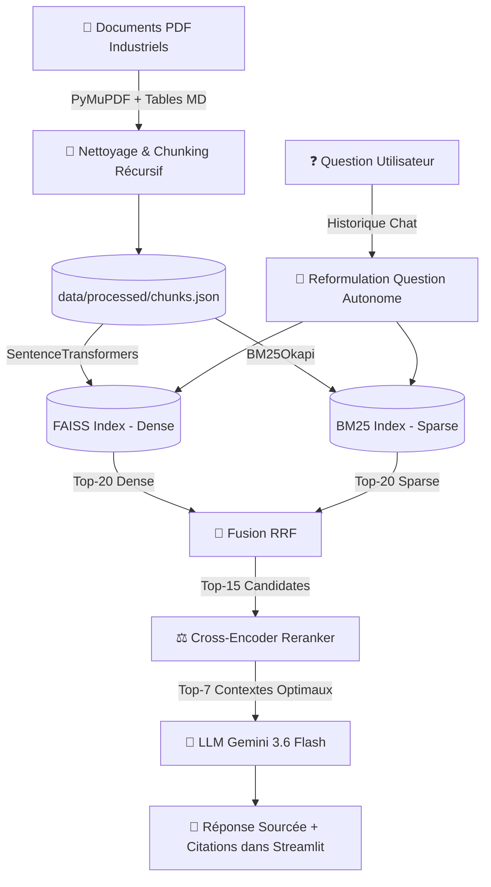

# 🏭 Assistant Documentaire Intelligent — RAG Industriel Avancé

> **Application RAG (Retrieval-Augmented Generation) de niveau Production pour l'analyse de documents techniques et industriels.**
> 
> *Projet conçu avec **PyMuPDF**, **FAISS**, **BM25**, **Cross-Encoder Reranking**, **Gemini 3.6 Flash** et **Streamlit**.*

---

## 🌟 Points Forts du Projet

* **📄 Parsing & Tableaux Markdown** : Extraction haute fidélité avec **PyMuPDF** (`pymupdf`) capable de convertir automatiquement les tableaux complexes de maintenance et fiches techniques au format Markdown.
* **✂️ Découpage Récursif Sémantique** : Chunking récursif respectant la hiérarchie des paragraphes et des phrases (`\n\n`, `\n`, `. `, `, `) pour éviter les coupures arbitraires.
* **🎯 Recherche Hybride (Dense + Sparse)** :
  * **Dense (Sémantique)** : Index vectoriel **FAISS** alimenté par `paraphrase-multilingual-MiniLM-L12-v2`.
  * **Sparse (Mots-clés exacts)** : Index **BM25** (`rank-bm25`) pour capturer avec 100% de précision les références de pièces, normes ISO et codes d'erreur.
* **⚡ Fusion RRF (Reciprocal Rank Fusion)** : Combinaison des rangs vectoriels et mots-clés via la formule $RRF(d) = \sum \frac{1}{60 + r(d)}$.
* **⚖️ Reranking par Cross-Encoder** : Ré-ordonnancement fin des candidats avec `cross-encoder/ms-marco-MiniLM-L-6-v2` pour sélectionner les 7 meilleurs extraits.
* **💬 Mémoire Multi-tours (Condense Question)** : Reformulation automatique des questions de suivi (*"Et quelle est sa température max ?"*) en questions autonomes basées sur le contexte récent.
* **🖥️ Interface Streamlit Autonome** :
  * Téléversement de nouveaux PDF en 1 clic (`st.file_uploader`).
  * Ré-indexation 1-clic depuis la barre latérale.
  * Gestion du corpus (visualisation et suppression de documents).
  * Affichage des sources avec scores du Reranker.

---

## 📐 Architecture du Pipeline RAG



---

## 🛠️ Stack Technique

* **Langage & Environnement** : Python 3.10+, `uv` (Gestionnaire de paquets ultra-rapide).
* **Extraction PDF** : `PyMuPDF` (`fitz`).
* **Vector Store & Indexation** : `FAISS-cpu`, `rank-bm25`.
* **Modèles Local (Embeddings & Reranker)** : `sentence-transformers` (`paraphrase-multilingual-MiniLM-L12-v2`, `cross-encoder/ms-marco-MiniLM-L-6-v2`).
* **LLM (Génération)** : `google-genai` / `google-generativeai` (Gemini 3.6 Flash).
* **UI Web** : `streamlit`.

---

## 🚀 Installation & Utilisation

### 1. Prérequis & Clonage du Dépôt

```bash
git clone https://github.com/votre-compte/rag-industriel.git
cd rag-industriel
```

### 2. Configuration de l'Environnement

Installez les dépendances avec `uv` (ou avec `pip`) :

```bash
# Avec uv (Recommandé)
uv sync

# Ou avec pip dans un environnement virtuel classique
python -m venv .venv
source .venv/bin/activate  # Sur Linux/Mac
# .venv\Scripts\activate   # Sur Windows
pip install -r requirements.txt
```

### 3. Clé API Gemini

Créez un fichier `.env` à la racine du projet en vous basant sur `.env.example` :

```env
GEMINI_API_KEY="votre_cle_api_gemini_ici"
```
*(Obtenez une clé gratuite sur [Google AI Studio](https://aistudio.google.com/))*

### 4. Lancement de l'Application Web

```bash
# Avec uv
uv run streamlit run app.py

# Ou directement
streamlit run app.py
```

---

## 📂 Structure du Projet

```text
rag-industriel/
├── app.py                   # Interface Streamlit (Sidebar upload, chat, rerank display)
├── requirements.txt         # Dépendances du projet
├── pyproject.toml           # Configuration uv / packaging
├── .env.example             # Modèle de variables d'environnement
├── .gitignore               # Exclusion des clés API et fichiers volumineux
├── data/
│   ├── raw/                 # Fichiers PDF bruts (exclus de git)
│   └── processed/           # Index FAISS, BM25 et métadonnées (exclus de git)
└── src/
    ├── ingest.py            # Extraction PyMuPDF + Découpage récursif
    ├── embed_store.py       # Génération des index FAISS (Dense) & BM25 (Sparse)
    └── rag_pipeline.py      # Pipeline RAG (Fusion RRF + Reranker + Gemini 3.6)
```

---

## 📄 Licence & Contact

Projet développé dans le cadre de projets d'ingénierie IA / Machine Learning.
N'hésitez pas à me contacter ou à ouvrir une *Issue* / *Pull Request* !
